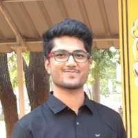

---
# Feel free to add content and custom Front Matter to this file.
# To modify the layout, see https://jekyllrb.com/docs/themes/#overriding-theme-defaults

layout: page
---

Hi, I am currently a graduate student at the [University of Colorado Boulder](https://colorado.edu/){:target="_blank"} pursuing a Master's in Computer Science. I am interested in exploring the fields of networks analysis, robotic planning and multi-agent systems.

I recently graduated from [Vellore Institute of Technology, India](https://vit.ac.in/){:target="_blank"} with a Bachelor's of Technology in Computer Science and Engineering. During my undergrad, I had a few research opportunities that paved the way for higher studies (and thus here I am at CU).

You can head over to the [About](/about) page to find more about my past academic records, experience and projects.

This website is a work-in-progress. I will continue to update it with new posts and projects.